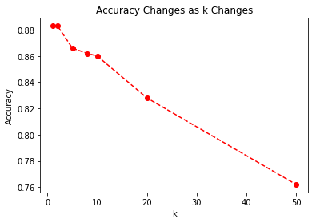
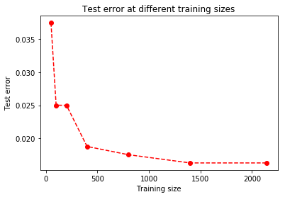

\newcommand\prob{\mathbb{P}}

```{r setup, include=FALSE}
library(reticulate)
use_python("c:\\users\\ADMINI~1\\appdata\\local\\programs\\python\\python37")
```


**<big>Question 1. k-Nearest Neighbors (kNN)</big>** 

For this problem, we can use the following codes to load data and set some useful function. Also I define some distance functions here like Euclidean for later use:
```{python}
import numpy as np
import matplotlib.pyplot as plt

# Load data
q1_digits = np.load('q1_data/q1_digits.npz')
digits_train = q1_digits['digits_train']
labels_train = q1_digits['labels_train']
digits_test = q1_digits['digits_test']
labels_test = q1_digits['labels_test'] 

def euclidean(x1, x2):
    return np.sum(np.square(x1 - x2))

# Manhattan distance implementation:
def manhattan(x1, x2):
    return np.linalg.norm(x1 - x2, ord = 1)

# Cosine similarity implementation:
def cosine(x1, x2):
    nu = np.sum(x1 * x2)
    de = np.linalg.norm(x1) * np.linalg.norm(x2)
    return 1 - nu / de

# Chebyshev distance implementation:
def chebyshev(x1, x2):
    return np.max(abs(x1 - x2))

def indirect(distance, X1, X2):
    options = {
        "euclidean": euclidean(X1, X2),
        "manhattan": manhattan(X1, X2),
        "cosine": cosine(X1, X2),
        "chebyshev": chebyshev(X1, X2)
    }
    return options[distance]

def get_neighbor(k, X_train, x_test, dist):
    distance_dic = {}
    for i in range(len(X_train)):
        distance = indirect(dist, X_train[i], x_test)
        distance_dic[i] = distance
    sorted_dic = sorted(distance_dic.items(), key = lambda x: x[1])[:k]
    return sorted_dic
```


***(a)*** 

Implement the following codes in \textbf{q1.ipynb} and we can get the corresponding indices for the 8 nearest neighbors and their class labels. We can see the images for the first 5 samples in the test data and their 8 nearest neighbors correspondly from the source code in \textbf{q1.ipynb} and the attached submitted folder of images. For the indices and class labels of the 8 nearest neighbors for each test digit, we can check the result from the following codes:
```{python}
def q_a(k, X_train, y_train, X_test):
    for j in range(len(X_test)):
        neighbors = get_neighbor(k, X_train, X_test[j], "euclidean")
        indices = [d[0] for d in neighbors]
        classes = [np.asscalar(i) for i in y_train[indices]]
        print("The indices for {} nearest neighbors of test image {} are: {}".format(k, j, indices))
        print("The classes for {} nearest neighbors of test image {} are: {}".format(k, j, classes))

q_a(8, digits_train, labels_train, digits_test[:5])
```


***(b)*** 

To classify all the samples in the test set, we can implment the following code, and show the accuracy when $k = 10$ (Details can be also found in \textbf{q1.ipynb}):
```{python}
def classify(indices, labels):
    count_dic = {}
    for item in zip(indices, labels):
        if not item[1] in count_dic:
            count_dic[item[1]] = 0
        count_dic[item[1]] += 1
    predicted_class = sorted(count_dic.items(), key = lambda x: -x[1])[0][0]
    return predicted_class


def get_accuracy(true_y, predicted_y):
    count = 0
    l = len(true_y)
    for i in range(l):
        if true_y[i] == predicted_y[i]:
            count += 1
    accuracy = count / l
    print("The classification accuracy is {}".format(accuracy))
    return accuracy
```

The following code gives the training of knn for $k = 10$ on the overall test set and outputs the accuracy to be \textbf{0.86}:
```{python}
def q_b(k, X_train, y_train, X_test, y_test, dist = "euclidean"):
    true_y_list = [np.asscalar(i) for i in y_test]
    predicted_y_list = []
    
    for j in range(len(X_test)):
        neighbors = get_neighbor(k, X_train, X_test[j], dist)
        indices = [d[0] for d in neighbors]
        classes = [np.asscalar(i) for i in y_train[indices]]
        predicted_class = classify(indices, classes)
        predicted_y_list.append(predicted_class)
    accuracy = get_accuracy(true_y_list, predicted_y_list)
    return accuracy
q_b(10, digits_train.reshape(len(digits_train), 784), labels_train, digits_test.reshape(len(digits_test), 784), labels_test)
```


***(c)*** 

Based on my implmentation of kNN, we can say the \textbf{advantage} of kNN method is that \textbf{the idea is very simple and it doesn't need to learn anything, totally based on the interior distance between a test sample and the training ones.} Additionally \textbf{the overall performance when using kNN is generally not bad}, though it depends on the choice of distance measurement and the number of $k$. 

The \textbf{disadvantage} of kNN is mainly due to the \textbf{computational complexity}, when the training sample is very large, it has to go over each training sample and calculate their distance for one particular test sample, which leads to extremely high complexity, and thus very slow. 

The difference choices of $k$ can lead to difference performance and the result can be shown using the piece of code and generated graph shown in \textbf{q1.ipynb}. Due to the consideration of the computational cost, I only select the testing value of $k$ to be (1,2,5,8,10,20,50) and we can see the plot here:

```{r q1c, echo=FALSE, out.width = '80%', fig.align="center"}

```

As we can see, the change of $k$ influences the performance of the kNN classifier, as $k$ increases, the accuracy decreases, especially for high value of $k$.


***(d)*** 

The basic common method to improve the performance of kNN is to use a different distance metric, as previously stated, here I tried several other distance metrics, like Manhattan distance, cosine similarities and chebyshev distance. And still, I set the $k$ value to be 10, and fed those distance metrics into the classfier using the same piece of code for part (b).

The final result shows that only the cosine distance can achieve a better performance than the euclidean distance at $k = 10$, which achieves an accuracy as \textbf{0.878} compared to 0.86. 


**<big>Question 2. Softmax Regression via Gradient Ascent (kNN)</big>**

***(a)*** 

For the log-likelihood in softmax, to derive the gradien for $\nabla_{\textbf{w}_m} l(\textbf{w})$ where $m = 1, 2, ..., K-1$, we need to separate those terms that $y^{(i)} = m$ and those $y^{(i)} \neq m$:
$$\begin{aligned}
  \nabla_{\textbf{w}_m} l(\textbf{w}) &= \nabla_{\textbf{w}_m}\log\ L(\textbf{w})\\
                                      &= \nabla_{\textbf{w}_m}\sum_{i=1}^N\sum_{k=1}^K\log[p(y^{(i)} = k | \phi(\textbf{x}^{(i)}), \textbf{w})]^{\textbf{I}(y^{(i)}=k)}\\
                                      &= \nabla_{\textbf{w}_m}\sum_{i=1}^N\{\log[p(y^{(i)} = m | \phi(\textbf{x}^{(i)}), \textbf{w})]^{\textbf{I}(y^{(i)}=m)} + \sum_{k\neq m,K}^K\log[p(y^{(i)} = k | \phi(\textbf{x}^{(i)}), \textbf{w})]^{\textbf{I}(y^{(i)}=k)} \\
                                      &\ \ \ \ \ + \log[p(y^{(i)} = K | \phi(\textbf{x}^{(i)}), \textbf{w})]^{\textbf{I}(y^{(i)}=K)}\}\\
                                      &= \nabla_{\textbf{w}_m}\sum_{i=1}^N\log[p(y^{(i)} = m | \phi(\textbf{x}^{(i)}), \textbf{w})]^{\textbf{I}(y^{(i)}=m)} + \nabla_{\textbf{w}_m}\sum_{i=1}^N\sum_{k\neq m,K}^K\log[p(y^{(i)} = k | \phi(\textbf{x}^{(i)}), \textbf{w})]^{\textbf{I}(y^{(i)}=k)} \\
                                      &\ \ \ \ \ + \nabla_{\textbf{w}_K}\sum_{i=1}^N\log[p(y^{(i)} = K | \phi(\textbf{x}^{(i)}), \textbf{w})]^{\textbf{I}(y^{(i)}=K)}.
\end{aligned}$$
Since we know that the latter two term has only one with $\textbf{w}_m$ and are easier to simplify, thus we can derive that 
$$\nabla_{\textbf{w}_m}\sum_{i=1}^N\sum_{k\neq m,K}^K\log[p(y^{(i)} = k | \phi(\textbf{x}^{(i)}), \textbf{w})]^{\textbf{I}(y^{(i)}=k)} = \sum_{i=1}^N\sum_{k\neq m,K}^K\textbf{I}(y^{(i)}=k)\frac{1}{1 + \sum_{j=1}^{K-1}\exp(\textbf{w}_j^T\phi(\textbf{x}^{(i)}))}\phi(\textbf{x}^{(i)})\exp(\textbf{w}_m^T\phi(\textbf{x}^{(i)})),$$
$$\nabla_{\textbf{w}_m}\sum_{i=1}^N\log[p(y^{(i)} = K | \phi(\textbf{x}^{(i)}), \textbf{w})]^{\textbf{I}(y^{(i)}=K)} = \sum_{i=1}^N\textbf{I}(y^{(i)}=K)\frac{1}{1 + \sum_{j=1}^{K-1}\exp(\textbf{w}_j^T\phi(\textbf{x}^{(i)}))}\phi(\textbf{x}^{(i)})\exp(\textbf{w}_m^T\phi(\textbf{x}^{(i)})),$$

Now we can simplify the complex term:
$$\begin{aligned}
  \sum_{i=1}^N\nabla_{\textbf{w}_m}\log[p(y^{(i)} = m | \textbf{x}^{(i)}, \textbf{w})]^{\textbf{I}(y^{(i)}=m)} &= \sum_{i=1}^N\textbf{I}(y^{(i)}=m)\nabla_{\textbf{w}_m}\log[p(y^{(i)} = m | \textbf{x}^{(i)}, \textbf{w})] \\
                                      &= \sum_{i=1}^N\textbf{I}(y^{(i)}=m)\nabla_{\textbf{w}_m}\log[\frac{\exp(\textbf{w}_m^T\phi(\textbf{x}^{(i)}))}{1 + \sum_{j=1}^{K-1}\exp(\textbf{w}_j^T\phi(\textbf{x}^{(i)}))}],
\end{aligned}$$
we can easily get
$$\nabla_{\textbf{w}_m} \exp(\textbf{w}_j^T\phi(\textbf{x}^{(i)})) = \phi(\textbf{x}^{(i)})\exp(\textbf{w}_j^T\phi(\textbf{x}^{(i)}))$$
using the chain rule, to simplify the above gradient, we can do a bit more chain rule for the whole quotient term:
$$\begin{aligned}
   \sum_{i=1}^N\textbf{I}(y^{(i)}=m)\nabla_{\textbf{w}_m}\log[\frac{\exp(\textbf{w}_m^T\phi(\textbf{x}^{(i)}))}{1 + \sum_{j=1}^{K-1}\exp(\textbf{w}_j^T\phi(\textbf{x}^{(i)}))}] 
                                      &= \sum_{i=1}^N\textbf{I}(y^{(i)}=m)\frac{\phi(\textbf{x}^{(i)})(1 + \sum_{j=1}^{K-1}\exp(\textbf{w}_j^T\phi(\textbf{x}^{(i)}))) - \phi(\textbf{x}^{(i)})\exp(\textbf{w}_m^T\phi(\textbf{x}^{(i)}))}{1 + \sum_{j=1}^{K-1}\exp(\textbf{w}_j^T\phi(\textbf{x}^{(i)}))} \\
                                      &= \sum_{i=1}^N\textbf{I}(y^{(i)}=m)\phi(\textbf{x}^{(i)})[1 - \frac{\exp(\textbf{w}_m^T\phi(\textbf{x}^{(i)}))}{1 + \sum_{j=1}^{K-1}\exp(\textbf{w}_j^T\phi(\textbf{x}^{(i)}))}]
\end{aligned}$$

So combine all the results together, since for each $y^{(i)}$, only one of $\textbf{I}(y^{(i)} = k)$ can be nonzero, so:
$$\begin{aligned}
  \nabla_{\textbf{w}_m} l(\textbf{w}) &= \sum_{i=1}^N\textbf{I}(y^{(i)}=m)\phi(\textbf{x}^{(i)})[1 - \frac{\exp(\textbf{w}_m^T\phi(\textbf{x}^{(i)}))}{1 + \sum_{j=1}^{K-1}\exp(\textbf{w}_j^T\phi(\textbf{x}^{(i)}))}] \\
                                  &\ \ \ \ \ + \sum_{i=1}^N\sum_{k\neq m,K}^K\textbf{I}(y^{(i)}=k)\frac{1}{1 + \sum_{j=1}^{K-1}\exp(\textbf{w}_j^T\phi(\textbf{x}^{(i)}))}\phi(\textbf{x}^{(i)})\exp(\textbf{w}_m^T\phi(\textbf{x}^{(i)}))\\
                                  &\ \ \ \ \ + \sum_{i=1}^N\textbf{I}(y^{(i)}=K)\frac{1}{1 + \sum_{j=1}^{K-1}\exp(\textbf{w}_j^T\phi(\textbf{x}^{(i)}))}\phi(\textbf{x}^{(i)})\exp(\textbf{w}_m^T\phi(\textbf{x}^{(i)})) \\
                                    &= \sum_{i=1}^N\phi(\textbf{x}^{(i)})[\textbf{I}(y^{(i)}=m) - \frac{\exp(\textbf{w}_m^T\phi(\textbf{x}^{(i)}))}{1 + \sum_{j=1}^{K-1}\exp(\textbf{w}_j^T\phi(\textbf{x}^{(i)}))}] \\
                                    &= \sum_{i=1}^N\phi(\textbf{x}^{(i)})[\textbf{I}(y^{(i)}=m) - p(y^{(i)} = m|\phi(\textbf{x}^{(i)}), \textbf{w})].
\end{aligned}$$


***(b)*** 

By implementing the softmax regression on my own on the training data, from the following pieces of codes, the accuracy for my implemented model on the test data is \textbf{0.92}. Compared with the logistic regression from \textbf{sklearn} with the regularization term to be 1e-5, the \textbf{sklearn} gives the resulted accuracy as 0.96. Therefore, it shows that my result is only slightly less than the accuracy of the predictions from \textbf{sklearn}. All the relevant codes can be seen in \textbf{q2.ipynb}.


**<big>Question 3. Gaussian Discriminative Analysis</big>**

***(a)*** 

The posterior distribution of the label $y$ at \textbf{x} can be derived from the given prior distribution and likelihoods, where we know:
$$ p(\textbf{x}^{(i)}, y^{(i)} = 0) = p(\textbf{x}^{(i)} | y^{(i)} = 0)p(y^{(i)} = 0),$$
$$ p(\textbf{x}^{(i)}, y^{(i)} = 1) = p(\textbf{x}^{(i)} | y^{(i)} = 1)p(y^{(i)} = 1).$$
Represent the posterior distributions, notice that there is only one covariance matrix $\Sigma$.
$$\begin{aligned}
  p(y^{(i)} = 0 | \textbf{x}^{(i)}) &= p(\textbf{x}^{(i)} | y^{(i)} = 0)p(y^{(i)} = 0) \\
                                    &= \frac{1 - \phi}{(2\pi)^{\frac{M}{2}}|\Sigma|^{\frac{1}{2}}}\exp[-\frac{1}{2}(\textbf{x}^{(i)}-\mu_0)^T\Sigma^{-1}(\textbf{x}^{(i)}-\mu_0)].
\end{aligned}$$
$$\begin{aligned}
  p(y^{(i)} = 1 | \textbf{x}^{(i)}) &= p(\textbf{x}^{(i)} | y^{(i)} = 1)p(y^{(i)} = 1) \\
                                    &= \frac{\phi}{(2\pi)^{\frac{M}{2}}|\Sigma|^{\frac{1}{2}}}\exp[-\frac{1}{2}(\textbf{x}^{(i)}-\mu_1)^T\Sigma^{-1}(\textbf{x}^{(i)}-\mu_1)].
\end{aligned}$$
Now the log odd can be derived:
$$\begin{aligned}
  \alpha^{(i)} = \log\frac{p(y^{(i)} = 1 | \textbf{x}^{(i)})}{p(y^{(i)} = 0 | \textbf{x}^{(i)})} &= \log\frac{\exp[-\frac{1}{2}(\textbf{x}^{(i)}-\mu_1)^T\Sigma^{-1}(\textbf{x}^{(i)}-\mu_1)]}{\exp[-\frac{1}{2}(\textbf{x}^{(i)}-\mu_0)^T\Sigma^{-1}(\textbf{x}^{(i)}-\mu_0)]} + \log\frac{\phi}{1 - \phi} \\
  &= [-\frac{1}{2}(\textbf{x}^{(i)}-\mu_1)^T\Sigma^{-1}(\textbf{x}^{(i)}-\mu_1)] - [-\frac{1}{2}(\textbf{x}^{(i)}-\mu_0)^T\Sigma^{-1}(\textbf{x}^{(i)}-\mu_0)] + \log\frac{\phi}{1 - \phi} \\
  &= (\mu_1 - \mu_0)^T\Sigma^{-1}\textbf{x}^{(i)} - \frac{1}{2}\mu_1^T\Sigma^{-1}\mu_1 + \frac{1}{2}\mu_0^T\Sigma^{-1}\mu_0 + \log\frac{\phi}{1-\phi}.
\end{aligned}$$
Now we can let $w_0 = - \frac{1}{2}\mu_1^T\Sigma^{-1}\mu_1 + \frac{1}{2}\mu_0^T\Sigma^{-1}\mu_0 + \log\frac{\phi}{1-\phi}$ and generalize $\textbf{x}^{(i)}$ to $\textbf{x}$ such that 
$$ \alpha = (\mu_1 - \mu_0)^T\Sigma^{-1}\textbf{x} + w_0.$$
Here we can define the weight $\textbf{w} = (\mu_1 - \mu_0)^T\Sigma^{-1}$, and if we redefine \textbf{x} to be M + 1 dimensional vectors by adding an extra coordinate $\textbf{x}^{0} = \textbf{1}$, we can also let $\textbf{w}$ to be a new weight vector with M+1 dimension by adding $w_0$. Therefore finally, we can get:
$$\begin{aligned}
  p(y = 1 | \textbf{x}; \phi; \Sigma; \mu_0; \mu_1) &= \frac{1}{1 + \exp(-\alpha)} \\
                                                    &= \frac{1}{1 + \exp\{-[(\mu_1 - \mu_0)^T\Sigma^{-1}\textbf{x} + w_0)]\}} \\
                                                    &= \frac{1}{1 + \exp(-\textbf{w}^T\textbf{x})}.
\end{aligned}$$


***(b)*** 

Assuming that there is at least one positive and one negative example in the data, we can plug in the prior and the likelihood from (a) and further simplify:
$$\begin{aligned}
  \ell(\phi, \mu_0, \mu_1, \Sigma) &= \log\prod_{i=1}^Np(\textbf{x}^{(i)}|y^{(i)};\phi,\mu_0,\mu_1,\Sigma)p(y^{(i)};\phi) \\
                                  &= \sum_{i=1}^N\log p(\textbf{x}^{(i)}|y^{(i)};\phi,\mu_0,\mu_1,\Sigma)p(y^{(i)};\phi) \\
                                  &= \sum_{i=1}^N\log\{\frac{1}{(2\pi)^{\frac{1}{2}}|\Sigma|^{\frac{1}{2}}}\exp[-\frac{1}{2}(\textbf{x}^{(i)}-\mu_{y^{(i)}})^T\Sigma^{-1}(\textbf{x}^{(i)}-\mu_{y^{(i)}})]\} + y^{(i)}\log\phi + (1 - y^{(i)})\log(1 - \phi) \\
                                  &= \sum_{i=1}^N-\log(\sigma(2\pi)^{\frac{1}{2}}) - \frac{1}{2}(\textbf{x}^{(i)}-\mu_{y^{(i)}})^T\Sigma^{-1}(\textbf{x}^{(i)}-\mu_{y^{(i)}}) + y^{(i)}\log\phi + (1 - y^{(i)})\log(1 - \phi).
\end{aligned}$$
Now if we want to get the estimates for the four parameters, we need to set the gradient of the log-likelihood subject to one particular parameter to be 0. Let's start from $\phi$:
$$ \frac{d\ell}{d\phi} = \sum_{i=1}^N[\frac{y^{(i)}}{\phi} + \frac{1 - y^{(i)}}{\phi - 1}] = \sum_{i=1}^N\frac{\phi - y^{(i)}}{\phi(\phi-1)} = 0,$$
so we can get the maximum likelihood estimate for $\phi$:
$$ \phi = \frac{1}{N}\sum_{i=1}^Ny^{(i)} = \frac{1}{N}\sum_{i=1}^N1\{y^{(i)} = 1\}.$$
Similarly, for $\mu_0$ and $\mu_1$, since here $M = 1$, which means that $\textbf{x}^{(i)} = x^{(i)}$ is simply a scalar, then we can get:
$$ \frac{d\ell}{d\mu_0} = \sum_{i=1}^N-\Sigma^{-1}\frac{1}{2}\frac{d(x^{(i)}-\mu_0)^2}{d\mu_0}1\{y^{(i)} = 0\} = \sum_{i=1}^N\Sigma^{-1}[x^{(i)} - \mu_0]1\{y^{(i)} = 0\} = 0,$$
$$ \frac{d\ell}{d\mu_1} = \sum_{i=1}^N-\Sigma^{-1}\frac{1}{2}\frac{d(x^{(i)}-\mu_1)^2}{d\mu_1}1\{y^{(i)} = 1\} = \sum_{i=1}^N\Sigma^{-1}[x^{(i)} - \mu_1]1\{y^{(i)} = 1\} = 0,$$
so we can get the maximum likelihood estimate for $\mu_0$ and $\mu_1$:
$$ \mu_0 = \frac{\sum_{i=1}^N1\{y^{(i)} = 0\}x^{(i)}}{\sum_{i=1}^N1\{y^{(i)} = 0\}},$$
$$ \mu_1 = \frac{\sum_{i=1}^N1\{y^{(i)} = 1\}x^{(i)}}{\sum_{i=1}^N1\{y^{(i)} = 1\}}.$$
Lastly, for $\Sigma$, by letting $\textbf{x}^{(i)} - \mu_{y^{i}} = \textbf{c}^{(i)}$, we can also derive in general form that:
$$ \nabla_{\Sigma}\ell = \sum_{i=1}^N\nabla_{\Sigma}[-\log(|\Sigma|(2\pi)^{\frac{1}{2}}) - \frac{1}{2}\textbf{c}^{(i)T}\Sigma^{-1}\textbf{c}^{(i)}],$$
to make it to be zero, we can have:
$$\begin{aligned}
  \nabla_{\Sigma}\ell = 0 &= \sum_{i=1}^N-[\frac{\nabla_{\Sigma}|\Sigma|}{|\Sigma|} + \nabla_{\Sigma} \frac{1}{2}\textbf{c}^{(i)T}\Sigma^{-1}\textbf{c}^{(i)}].
\end{aligned}$$
Here since $\Sigma = [\sigma^2]$ as a scalar form, so if we find the estimate of $\Sigma$ under the gradient of $\nabla_{\Sigma}$ to be 0, it is equivalent to find the estimate of $\Sigma^{-1}$ under the gradient of $\nabla_{\Sigma^{-1}}$ to be 0. In this case, the gradient is very easy to be:
$$\begin{aligned}
  \nabla_{\Sigma^{-1}}\ell &= \sum_{i=1}^N\frac{1}{2}[\frac{1}{\Sigma^{-1}} - \textbf{c}^{(i)T}\textbf{c}^{(i)}] = 0.
\end{aligned}$$
So we can derive that $\Sigma^{-1} = \frac{1}{N\sum_{i=1}^N\textbf{c}^{(i)T}\textbf{c}^{(i)}}$ so that 
$$\Sigma = N\sum_{i=1}^N\textbf{c}^{(i)T}\textbf{c}^{(i)} = N\sum_{i=1}^N(\textbf{x}^{(i)} - \mu_{y^{(i)}})(\textbf{x}^{(i)} - \mu_{y^{(i)}})^T.$$


***(c)*** 
For the general case of $M \neq 1$, the derivation process will be nearly the same as what I did in part (b). The final result gives the same estimates for $\phi$:
$$ \phi = \frac{1}{N}\sum_{i=1}^N1\{y^{(i)} = 1\},$$
There's little difference for the $\mu$ part in the derivation, but gives the same form of results:
$$\begin{aligned}
  \frac{d\ell}{d\mu_0} &= \sum_{i=1}^N-\frac{1}{2}\frac{d}{d\mu_0}[(\textbf{x}^{(i)} - \mu_0)^T\Sigma^{-1}(\textbf{x}^{(i)} - \mu_0)]1\{y^{(i)} = 0\} \\
                      &= \sum_{i=1}^N-\Sigma^{-1}[\textbf{x}^{(i)} - \mu_0]1\{y^{(i)} = 0\} = 0,
\end{aligned}$$
$$\begin{aligned}
  \frac{d\ell}{d\mu_1} &= \sum_{i=1}^N-\frac{1}{2}\frac{d}{d\mu_1}[(\textbf{x}^{(i)} - \mu_1)^T\Sigma^{-1}(\textbf{x}^{(i)} - \mu_1)]1\{y^{(i)} = 1\} \\
                      &= \sum_{i=1}^N-\Sigma^{-1}[\textbf{x}^{(i)} - \mu_1]1\{y^{(i)} = 1\} = 0,
\end{aligned}$$

$$ \mu_0 = \frac{\sum_{i=1}^N1\{y^{(i)} = 0\}\textbf{x}^{(i)}}{\sum_{i=1}^N1\{y^{(i)} = 0\}},$$
$$ \mu_1 = \frac{\sum_{i=1}^N1\{y^{(i)} = 1\}\textbf{x}^{(i)}}{\sum_{i=1}^N1\{y^{(i)} = 1\}}.$$


**<big>Question 4. Naive Bayes for classifying SPAM</big>**

***(a)***
With the codes implemented in \textbf{q4.ipynb} and several main functions as defined below, the naive Bayes classifier gives the test error as 1.6250\%.


***(b)*** 
We can see the result from \textbf{q4.ipynb} that the naive Bayes classifier outputs the five tokens that are most indicative of the SPAM class as \textbf{httpaddr}, \textbf{spam}, \textbf{unsubscrib}, \textbf{ebai} and \textbf{valet}.


***(c)*** 
As we can see from the generated graph of test error in \textbf{q4.ipynb}, the original training set with the largest size of training sets and the training set with 1400 texts give the best test error as 1.6250\% among all the trained classifiers, indicating the fact that a large sample size would help improve the performance of a naive Bayes classifier.
```{r q4c, echo=FALSE, out.width = '80%', fig.align="center"}

```


**<big>Collaboration</big>** 
For this homework, I formed all the solutions my own but discussed the problem sets together with people in my assignment group, they are Junwei Deng, Dongjian Chen and Yunzhe Jiang.


